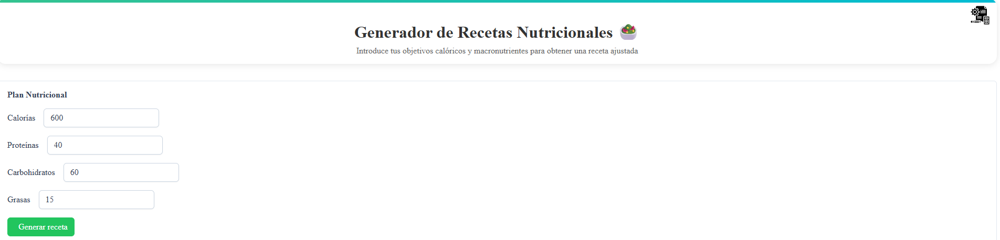
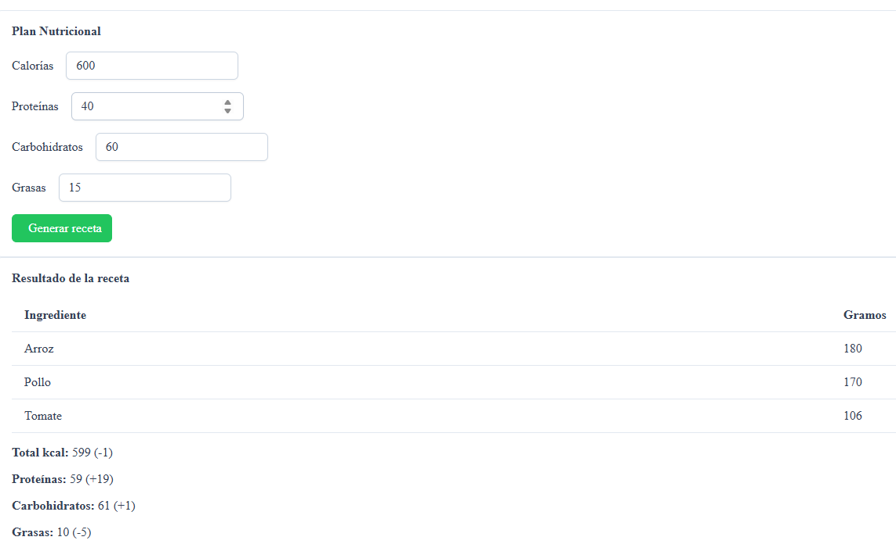
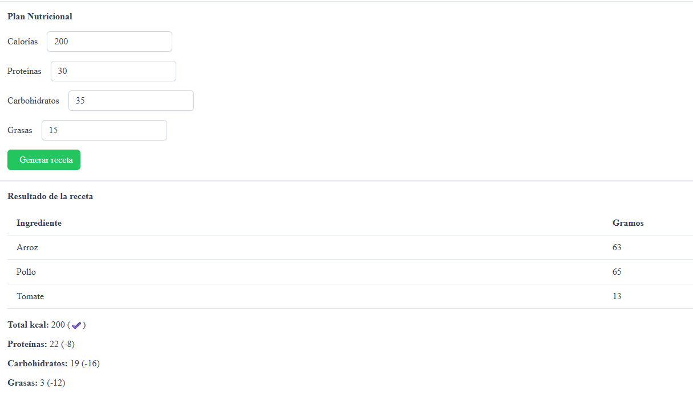

# 🥗 Generador de Receta Nutricional

Aplicación Angular que genera una receta ajustada a tus objetivos calóricos y macronutrientes, respetando proporciones entre ingredientes como arroz, pollo y tomate frito.

---

## 📑 Tabla de contenidos

- [📌 Introducción](#-introducción)
- [🛠️ Tecnologías y herramientas utilizadas](#-tecnologías-y-herramientas-utilizadas)
- [🚀 Ejecución del proyecto](#-ejecución-del-proyecto)
- [⚙️ Funcionamiento de la aplicación](#-funcionamiento-de-la-aplicación)
- [📸 Capturas de pantalla](#-capturas-de-pantalla)

---

## 📌 Introducción

Esta aplicación propone una receta a partir de unos objetivos calóricos y de macronutrientes (proteínas, carbohidratos y grasas), respetando las proporciones entre los ingredientes.

---

## 🛠️ Tecnologías y herramientas utilizadas

- ⚡ **Angular** – Framework principal para el desarrollo frontend.
- 🎨 **PrimeNG** – Biblioteca de componentes UI rica y responsiva.
- 💬 **SweetAlert2** – Para mostrar pop-ups amigables al usuario.

<div align="center">
  
  
  
</div>

---

## 🚀 Ejecución del proyecto

Para ejecutar la aplicación en local:

1. Clonar el repositorio:

   ```bash
   git clone https://github.com/rubeneitor/pruebaTecnicaAngular.git 
   ```
2. Acceder a la carpeta del proyecto:
    ```bash
    cd nombre-del-proyecto
    ```
3. Instalar dependencias:
    ```bash
    npm install
    ```
4. Ejecutar la aplicación:
    ```bash
    npm start 
    # o
    ng serve
    ```

## ⚙️ Funcionamiento de la aplicación
- La app permite generar una receta ajustada a los objetivos calóricos y de macronutrientes introducidos por el usuario.

- Se inicia con valores por defecto para una receta base.

- Puedes modificar los valores y volver a generar la receta tantas veces como quieras.

- Los cálculos de kcal, proteínas, carbohidratos y grasas se basan en datos nutricionales estándar por ingrediente.

## 📸 Capturas de pantalla
A continuación se muestran algunas imágenes del funcionamiento de la app:

<p align="center">  </p> <p align="center">  </p> <p align="center">  </p>


## 🧠 Autor
Rubén Viosquez Beades

 